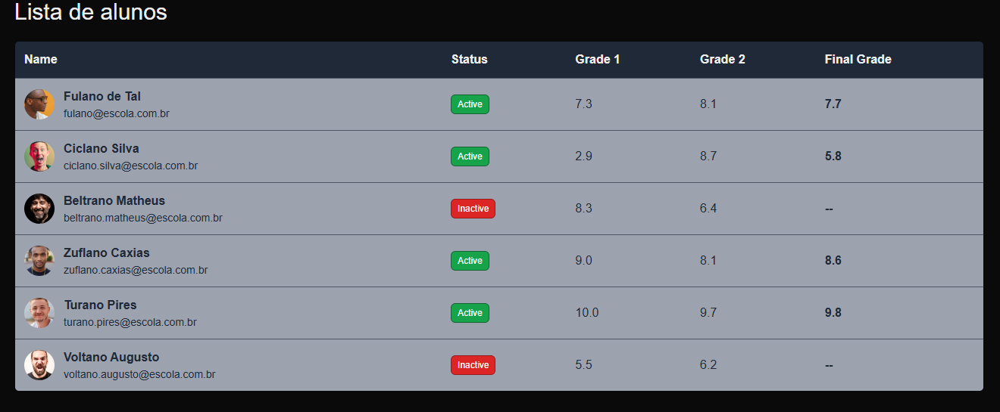

🧑‍🎓 Student Table

Student Table é uma aplicação desenvolvida para exibir informações sobre alunos, incluindo suas notas e status de atividade. O projeto é construído utilizando React, TypeScript, HTML e CSS, com uma interface responsiva e intuitiva.

---

### 🚀 Acesse o projeto:
🔗 [Student Table - Clique aqui para acessar](https://tabela-estudantes-jdsp.vercel.app/)

---

### 🔧 Tecnologias Utilizadas
- **React**: Framework para construção da interface.
- **TypeScript**: Para a tipagem estática e maior segurança no código.
- **HTML & CSS**: Estrutura e estilização do projeto.
- **Vercel**: Plataforma de hospedagem para o deploy.

---

### ⚙️ Funcionalidades
- Exibição de informações detalhadas dos alunos: nome, status (ativo ou inativo), notas e média final.
- Status dinâmico que varia conforme a atividade do aluno.
- Interface intuitiva com imagens de perfil dos alunos.
- Cálculo da média final automaticamente para alunos ativos.

---

### 🖼 Screenshots
#### Página Inicial

### 📄 Licença
Este projeto está sob a licença MIT. Veja o arquivo [LICENSE](LICENSE) para mais detalhes.

---

### 👤 Autor
**Mathias Fuhr**  
- 🌐 [LinkedIn](https://www.linkedin.com/in/mathiasgilvanfuhr/)  
- 📧 mathiasgfuhr@gmail.com

